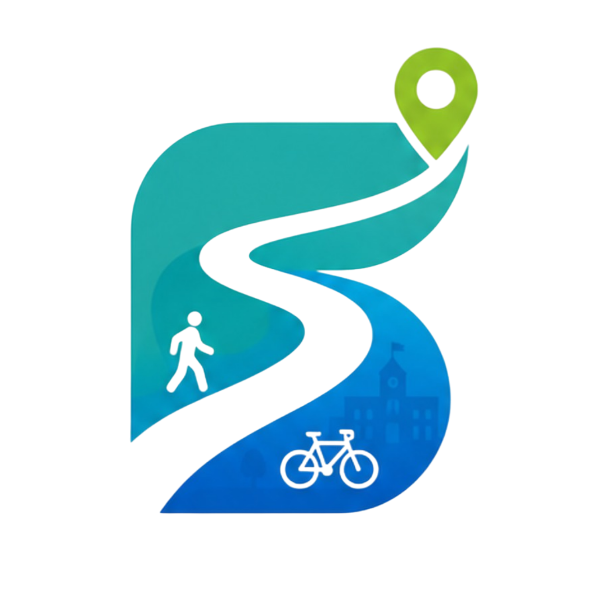

<div align="center">



### Movilidad urbana accesible para quienes más lo necesitan

*Navegación por voz · Rutas accesibles con IA · Reportes ciudadanos en tiempo real*

**Hack4Mobility 2025 · Tlalpan, CDMX**

---


</div>

---

## Estado del proyecto

| Hito | Estado |
|---|---|
| MVP funcional (Hack4Mobility) | Completo |
| Containerización Docker + IBM Cloud Code Engine | Completo |
| EAS Build — app nativa iOS/Android | En progreso |
| Persistencia de reportes ciudadanos | Completo |
| Integración IBM watsonx.ai (Granite) | Próximo |
| Dashboard de analítica para IBM | Próximo |
| Deploy enterprise IBM Cloud | Próximo |

---

## Problemática — Los 5 Porqués

> *¿Por qué las personas no pueden moverse con seguridad en Tlalpan?*

| # | Pregunta | Respuesta |
|---|---|---|
| 1 | ¿Por qué no se mueven con seguridad? | Porque no saben qué calles, colonias o rutas son accesibles para ellas |
| 2 | ¿Por qué no lo saben? | Porque no existe una herramienta que integre datos de infraestructura urbana con navegación en tiempo real |
| 3 | ¿Por qué no existe esa herramienta? | Porque los datos abiertos de la ciudad están dispersos y sin procesar — nadie los ha convertido en algo accionable |
| 4 | ¿Por qué nadie los ha procesado? | Porque requiere cruzar datos geoespaciales, modelos de IA y experiencia de usuario móvil al mismo tiempo |
| 5 | ¿Por qué no se cruzan esas disciplinas? | Porque las soluciones de movilidad existentes priorizan velocidad sobre accesibilidad, ignorando a +30% de la población |

**Causa raíz:** La infraestructura de datos existe pero está desconectada del ciudadano. Alivía cierra esa brecha.

---

## Stakeholders

| Stakeholder | Rol | Qué gana con Alivía |
|---|---|---|
| **Personas con movilidad reducida** | Usuario primario | Navegación segura, rutas sin barreras, información real de su colonia |
| **Adultos mayores y ciclistas** | Usuario secundario | Rutas optimizadas por seguridad, no solo por tiempo |
| **Alcaldía Tlalpan / SEMOVI** | Gobierno | Datos ciudadanos para priorizar inversión en infraestructura |
| **IBM** | Socio tecnológico / cliente enterprise | Dataset de accesibilidad única en LATAM + canal de adopción ciudadana |
| **ONGs de accesibilidad urbana** | Aliado de difusión | Evidencia cuantitativa del estado de la infraestructura por colonia |
| **Investigadores y urbanistas** | Usuario de datos | API pública con scores de accesibilidad y reportes ciudadanos geolocalizados |

---

## ¿Qué es Alivía?

Alivía es una app móvil de navegación accesible para Tlalpan, CDMX. Ayuda a peatones, ciclistas y personas con movilidad reducida a moverse de forma segura usando datos abiertos de infraestructura urbana, inteligencia artificial y OpenStreetMap.

**179 colonias mapeadas · 18,000+ nodos de red vial · Análisis IA por colonia**

---

## Demo

```
+-----------------------------+
|  Mapa de accesibilidad      |
|  [ verde = accesible      ] |
|  [ rojo  = critico        ] |
|                             |
|  [ ? A donde vas?    [mic] ]|
|  [ Reportar ] [ Panico    ] |
|                             |
|  Zonas de riesgo            |
|  > San Miguel Xicalco  5.0  |
|  > La Fama             4.8  |
+-----------------------------+
```

> La app corre en iOS y Android via Expo Go. El frontend web es accesible desde cualquier navegador moderno.

---

## Funcionalidades

| Módulo | Descripción |
|---|---|
| Mapa de accesibilidad | Colonias coloreadas por score (verde → rojo) |
| Navegación Waze-style | Cámara sigue al usuario, brújula, pitch 3D |
| Rutas accesibles OSMnx | Ponderadas por score de accesibilidad en cada tramo |
| Rutas rápidas Mapbox | Optimizadas por tiempo/distancia |
| Turn-by-turn por voz | Instrucciones en español via gTTS + expo-av |
| Búsqueda por voz | Whisper (Groq) transcribe el destino hablado |
| Búsqueda de lugares | Mapbox Search Box API — POIs, calles, centros comerciales |
| Origen automático | Se toma de tu ubicación GPS al abrir rutas |
| Reportes ciudadanos | Inundación, zona insegura, operativo, tráfico, sin luz |
| Botón de pánico | Vibración + voz de alerta via expo-av |
| Asistente IA | Chat contextual sobre movilidad (Groq llama3-70b) |
| Datos curiosos | 50 estadísticas de movilidad urbana CDMX |

---

## Arquitectura

```
alivia/
 accesomov/ ← Frontend (Vite + React + Mapbox GL)
 back/ ← Backend (FastAPI + Groq + GeoPandas + OSMnx)
 mobile/ ← App móvil (Expo SDK 54 + WebView)
 docker-compose.yml ← Stack completo local
 railway.toml ← Deploy rápido
```

### Stack tecnológico

| Capa | Tecnología |
|---|---|
| Frontend | Vite · React 18 · Tailwind CSS · Framer Motion |
| Mapas | Mapbox GL JS · Mapbox Directions API · Mapbox Search Box API · react-map-gl |
| Routing accesible | OSMnx 2.x · NetworkX · GeoPandas (`accessibility_cost = distancia × score`) |
| Backend | FastAPI · Python 3.12 · GeoPandas · Shapely |
| IA / NLP | Groq API (llama-3.3-70b) · Whisper large-v3-turbo |
| TTS | gTTS (Google Text-to-Speech) vía backend |
| Móvil | Expo SDK 54 · React Native WebView · expo-location · expo-av · expo-speech |
| Datos | GeoJSON Tlalpan — Datos Abiertos CDMX |

---

## Instalación rápida

### Requisitos

- Node.js 18+ y Yarn
- Python 3.12+
- [Expo Go](https://expo.dev/go) en iPhone (SDK 54)
- Token [Mapbox](https://mapbox.com) (gratuito)
- API key [Groq](https://console.groq.com) (gratuita)

---

### Backend

```bash
cd back
python -m venv venv && source venv/bin/activate
pip install -r requirements.txt

cp .env.example .env
# Agregar: GROQ_API_KEY=gsk_...
```

```bash
./venv/bin/python -m uvicorn main:app --host 0.0.0.0 --port 8000 --env-file .env
```

> Docs interactivos: `http://localhost:8000/docs`

**Primera vez:** el backend descarga los grafos OSM de Tlalpan (~30s con internet) y los guarda como `tlalpan_walk.graphml` y `tlalpan_bike.graphml`. Los arranques siguientes cargan desde disco en ~2s.

---

### Frontend

```bash
cd accesomov
yarn install

cp .env.example .env
# Agregar: VITE_MAPBOX_TOKEN=pk.eyJ1...
```

```bash
yarn dev
```

---

### App móvil

```bash
cd mobile
yarn install
cp .env.example .env
# Agregar: EXPO_PUBLIC_FRONTEND_URL y EXPO_PUBLIC_BACKEND_URL
```

```bash
yarn start
# Escanear QR con Expo Go · misma red WiFi
```

---

## Variables de entorno

| Archivo | Variable | Descripción |
|---|---|---|
| `back/.env` | `GROQ_API_KEY` | API key de [Groq](https://console.groq.com) |
| `back/.env` | `ALLOWED_ORIGINS` | Orígenes CORS permitidos (coma-separados). Default: `*` |
| `accesomov/.env` | `VITE_MAPBOX_TOKEN` | Token de [Mapbox](https://account.mapbox.com) |
| `accesomov/.env` | `VITE_API_URL` | URL del backend, ej. `http://192.168.0.x:8000` |
| `mobile/.env` | `EXPO_PUBLIC_FRONTEND_URL` | URL del frontend deployado |
| `mobile/.env` | `EXPO_PUBLIC_BACKEND_URL` | URL del backend deployado |

En la misma red WiFi (para Expo Go), usa tu IP local en lugar de `localhost`:

```bash
# Obtener tu IP local en Mac
ipconfig getifaddr en0
```

```bash
cp accesomov/.env.example accesomov/.env
cp back/.env.example back/.env
cp mobile/.env.example mobile/.env
```

---

## Deploy en producción

El stack completo está containerizado y listo para IBM Cloud Code Engine.

### Stack completo con Docker Compose

```bash
cp back/.env.example back/.env # GROQ_API_KEY + ALLOWED_ORIGINS
cp accesomov/.env.example accesomov/.env # VITE_MAPBOX_TOKEN

docker compose up --build
# Frontend → http://localhost:3000
# Backend → http://localhost:8000
```

### IBM Cloud Code Engine

```bash
# Autenticarse
ibmcloud login
ibmcloud ce project create --name alivia-prod

# Backend
ibmcloud ce application create \
 --name alivia-backend \
 --image icr.io/alivia/backend:latest \
 --port 8000 \
 --env GROQ_API_KEY=<key> \
 --env ALLOWED_ORIGINS=https://alivia-frontend.your-domain.com

# Frontend
ibmcloud ce application create \
 --name alivia-frontend \
 --image icr.io/alivia/frontend:latest \
 --port 80
```

> Las imágenes se publican en IBM Container Registry (`icr.io`). Code Engine escala a cero cuando no hay tráfico y cumple con las regulaciones de datos de gobierno de CDMX requeridas para contratos con alcaldías.

---

## Endpoints del backend

| Método | Ruta | Descripción |
|---|---|---|
| `GET` | `/colonias` | GeoJSON colonias con scores (simplificado) |
| `GET` | `/resumen` | Estadísticas generales de accesibilidad |
| `GET` | `/zonas-riesgo` | Colonias con score ≥ 4 |
| `GET` | `/colonias/{cve_col}` | Detalle + análisis IA |
| `POST` | `/chat` | Chat con asistente de movilidad |
| `POST` | `/ruta-analisis` | Análisis de ruta Mapbox |
| `POST` | `/ruta-osm` | Ruta accesible via OSMnx |
| `POST` | `/transcribir` | STT multipart (Whisper) |
| `POST` | `/transcribir-b64` | STT base64 JSON (app móvil) |
| `GET` | `/tts?text=...` | TTS español → MP3 (gTTS) |
| `GET` | `/osm-status` | Estado de grafos OSM |

---

## Cómo funciona

### Routing accesible (OSMnx)

```
OSM (OpenStreetMap)
 ↓ osmnx.graph_from_place("Tlalpan")
 Red vial (18k nodos, 48k aristas)
 ↓ gpd.sjoin (spatial join masivo)
 Cada arista hereda score_colonia del GeoJSON
 ↓ accessibility_cost = longitud × score
 NetworkX shortest_path(weight="accessibility_cost")
 ↓
 Ruta que evita zonas sin rampas/banquetas
```

A diferencia de Mapbox Directions (minimiza tiempo), OSMnx minimiza el **costo de accesibilidad**. Una calle de 200m en zona score=5 (crítica) cuesta 1000; en zona score=2 (buena) cuesta 400 — prefiere el segundo camino aunque sea más largo.

### Navegación por voz

```
Usuario toca "Iniciar navegación"
 ↓
 startNavigation() → speak("Hola! Vamos hacia X...")
 ↓ gTTS genera MP3 en backend
 expo-av reproduce con playsInSilentModeIOS=true
 ↓
 useEffect([userLocation]) detecta proximidad a giros
 → anuncia siguiente instrucción a ≤80m del punto
 → "Llegaste a X" al estar a ≤30m del destino
```

### Búsqueda por voz

```
Mantén presionado el micrófono → expo-av graba M4A
 ↓ FileSystem.readAsStringAsync (base64)
 POST /transcribir-b64 → Groq Whisper large-v3-turbo
 ↓ language=es, prompt con contexto Tlalpan
 Texto transcrito aparece en campo de búsqueda
 ↓ Toca "Ir a X"
 Mapbox Search Box → coordenadas → ruta
```

### Geolocalización en móvil

`navigator.geolocation` no funciona en WebView. La solución:

```
expo-location (nativo)
 watchPositionAsync → lat/lng cada 2s
 watchHeadingAsync → heading magnético continuo
 ↓ injectJavaScript
 window.__nativeLocation = {lat, lng, heading}
 window.__compass = degrees
 ↓ CustomEvent / polling
 React → punto naranja en mapa + rotación brújula
```

---

## Score de accesibilidad

| Score | Color | Interpretación |
|---|---|---|
| ≤ 2.5 | Verde | Buena accesibilidad |
| 2.5 – 3.5 | Amarillo | Media |
| 3.5 – 4.5 | Naranja | Deficiente |
| > 4.5 | Rojo | Crítica |

Calculado con: infraestructura peatonal (40%) · ciclista (25%) · iluminación (20%) · densidad vial (15%).

---

## Estructura del frontend

```
src/
 App.jsx # Layout, estado global, geolocalización, pánico
 config.js # URL del backend
 index.css # Sistema de diseño (naranja + blanco)
 hooks/
 useVoice.js # Grabación de voz via canal nativo Expo
 components/
 MapView.jsx # Mapa principal con capas GeoJSON
 NavigationView.jsx # Rutas, búsqueda, navegación Waze-style
 ChatView.jsx # Asistente IA (sidebar)
 ColoniaDetail.jsx # Panel de detalle de colonia
 DidYouKnow.jsx # 50 datos curiosos sobre movilidad CDMX
 SidebarStats.jsx # Estadísticas de accesibilidad
 ZonasRiesgo.jsx # Lista de colonias de alto riesgo
 LiquidGlass.jsx # Componente LiquidButton
 Toast.jsx # Notificaciones de error
```

---

## Datos utilizados

| Dataset | Fuente |
|---|---|
| Infraestructura peatonal y ciclista | Instituto de Planeación Democrática y Prospectiva, CDMX |
| Red vial OpenStreetMap | © OpenStreetMap contributors |
| Estadísticas de movilidad | TomTom 2024 · SEMOVI 2025 · INEGI · STC Metro |

---

<div align="center">

## Alivía × IBM — Data Partnership

*Infraestructura citizen-first para ciudades inteligentes en LATAM*

</div>

Alivía fue construida como plataforma de recopilación de datos de movilidad ciudadana, con integración directa a los productos de IBM para ciudades inteligentes.

### Qué aporta Alivía a IBM

| Activo | Descripción |
|---|---|
| Dataset de accesibilidad | 179 colonias de Tlalpan con scores calculados a partir de datos abiertos de infraestructura urbana |
| Reportes ciudadanos geolocalizados | Inundaciones, zonas inseguras, operativos, cortes de luz — capturados en tiempo real por usuarios en campo |
| Canal de adopción ciudadana | App funcional con UX probada en hackathon, escalable a más alcaldías |
| Narrativa ESG | Accesibilidad para personas con movilidad reducida, adultos mayores y ciclistas — alineada con metas de impacto social de IBM |

### Integración técnica con IBM

| Componente IBM | Rol en Alivía |
|---|---|
| **watsonx.ai (Granite)** | Reemplaza Groq como modelo base del asistente de movilidad — misma interfaz, mayor alineación con la oferta IBM |
| **IBM Environmental Intelligence Suite** | Enriquece los scores de colonia con datos de clima, inundación y calidad del aire en tiempo real |
| **IBM Maximo Spatial** | Cruza los reportes ciudadanos con el inventario de infraestructura urbana de la alcaldía |
| **IBM App ID** | Autenticación de usuarios para que los reportes sean auditables y atribuibles |
| **IBM Cloud Code Engine** | Hosting enterprise con cumplimiento de datos de gobierno — containerizado y listo |

### Qué falta para la siguiente conversación con IBM

1. **Persistencia de reportes** — los reportes ciudadanos aún no se guardan en base de datos; sin esto no hay dataset que ofrecer
2. **Dashboard de analítica** — IBM necesita visualizar los datos antes de cualquier acuerdo
3. **Integración watsonx.ai** — cambiar el endpoint `/chat` de Groq a Granite para la demo
4. **Framework de consentimiento** — requerido por legal para que IBM use los datos en sus plataformas

### Modelo de negocio propuesto

> Alivía aporta el canal ciudadano y los datos del terreno. IBM aporta la infraestructura enterprise y la distribución a gobiernos. Los datos pertenecen a la ciudad — Alivía los recopila, IBM los procesa, los gobiernos los usan.

- IBM paga por el dataset limpio y estructurado (por colonia, por mes)
- IBM co-brandea la app como parte de su oferta de smart cities para CDMX
- Revenue share cuando la plataforma se venda a otras ciudades de LATAM

---

## Consideraciones éticas

- Datos agregados por colonia — sin información personal
- Sin recolección de ubicaciones ni seguimiento de usuarios
- Descripciones de IA son orientativas, no diagnósticos técnicos
- Zonas periféricas pueden estar subrepresentadas en los datos fuente

---

## Equipo

<div align="center">

| Nombre | Rol |
|---|---|
| Ximena Camarillo Morales | |
| Alejandro Salazar Loza | |
| David Antonio Zárate Villaseñor | |

**Hack4Mobility 2025 · Tlalpan, CDMX**

</div>
